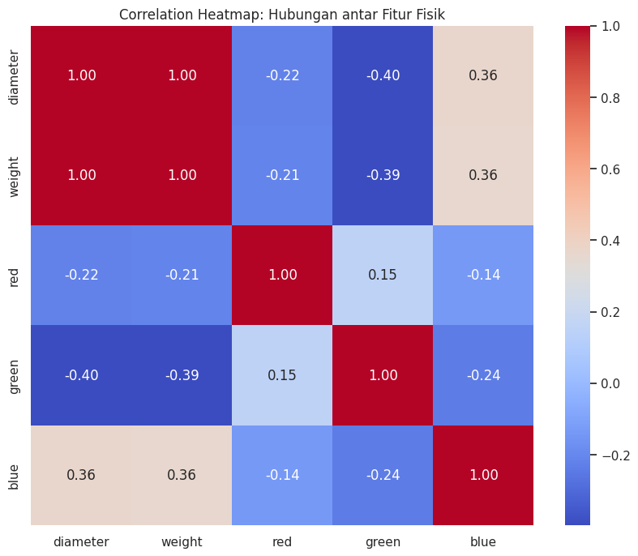
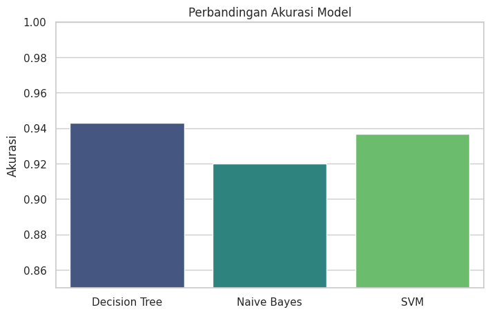
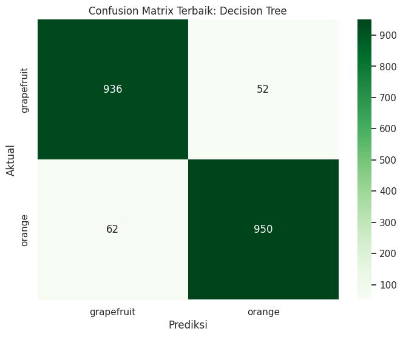

# Klasifikasi Buah Orange and Grapefruit: Perbandingan Algoritma Machine Learning pada Dataset Citrus


## Ringkasan Proyek
Proyek ini merupakan bagian dari Ujian Tengah Semester (UTS) untuk membangun model klasifikasi otomatis yang membedakan antara buah **Jeruk (Orange)** dan **Anggur (Grapefruit)**. Penelitian ini membandingkan tiga algoritma utama: **Decision Tree**, **Naive Bayes**, dan **Support Vector Machine (SVM)**.

## Eksplorasi Data (EDA)
Dataset yang digunakan berasal dari Kaggle (*Josh McAdams*) yang berisi 10,000 sampel data.
* **Fitur Utama**: Diameter, Weight, Red, Green, Blue.
* **Target**: Name (Orange/Grapefruit).

...
### Analisis Visual
Berdasarkan hasil penelitian, berikut adalah visualisasi data yang dilakukan:

1. **Correlation Heatmap**: Mengidentifikasi hubungan antara berat, diameter, dan intensitas warna terhadap jenis buah.
2. **Distribution Plot**: Melihat bagaimana diameter dan berat saling tumpang tindih antar kelas.

> 
> *Gambar 1: Korelasi antar fitur fisik.*

---

## Metodologi
Tahapan yang dilakukan dalam eksperimen ini adalah:

1. **Data Acquisition**: Menggunakan `kagglehub` untuk penarikan data otomatis.
2. **Preprocessing**: 
    - Menggunakan `LabelEncoder` untuk target kategorikal.
    - Menggunakan `StandardScaler` untuk normalisasi fitur agar performa SVM optimal.
3. **Data Splitting**: Pembagian data 80:20 (8000 training, 2000 testing).
4. **Modeling**: Implementasi Decision Tree, Gaussian Naive Bayes, dan SVM (RBF Kernel).

---

## Hasil Evaluasi Model

Berdasarkan pengujian pada Google Colab, berikut adalah perbandingan performa ketiga model:

| Model | Akurasi | Precision (Avg) | Recall (Avg) | F1-Score |
| :--- | :--- | :--- | :--- | :--- |
| **Decision Tree** | **93.95%** | **0.94** | **0.94** | **0.94** |
| **SVM** | 93.70% | 0.94 | 0.94 | 0.94 |
| **Naive Bayes** | 92.00% | 0.92 | 0.92 | 0.92 |

### Visualisasi Performa
Akurasi tertinggi dicapai oleh **Decision Tree**. Berikut adalah perbandingan visual akurasi dan confusion matrix model terbaik:

> 
> *Gambar 2: Perbandingan akurasi antar ketiga model.*

> 
> *Gambar 3: Confusion Matrix dari model Decision Tree.*

---

## Kesimpulan
- **Decision Tree** terbukti paling efektif untuk dataset ini dengan akurasi **93.95%**.
- **SVM** memberikan hasil yang sangat kompetitif berkat penggunaan scaling data.
- Karakteristik warna (RGB) dan dimensi fisik (Diameter/Weight) memiliki pengaruh signifikan dalam membedakan kedua jenis buah ini.

## Cara Menjalankan
1. Clone repository ini:
   ```bash
   git clone [https://github.com/Fatihmaull/fruit-detection-machine-learning.git](https://github.com/Fatihmaull/fruit-detection-machine-learning.git)
